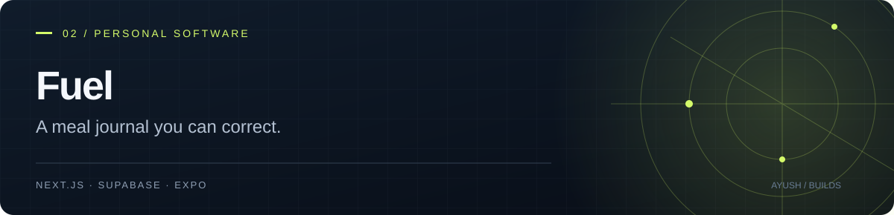

# Fuel
### A meal journal you can correct.

[Open Fuel](https://fuel-journal.vercel.app) · [Download Android APK · 2.0.0](https://expo.dev/artifacts/eas/JRQigEVtW4Id8WkEQUIvY7BLjk41d5hA_ZrMIkb7iCg.apk) · [Privacy](https://fuel-journal.vercel.app/privacy)

Photograph a meal or type foods and quantities, review the estimated portions, and save the result to your journal. Package values and manual corrections let you replace estimates with the information you actually have.

**Next.js · TypeScript · Supabase · Gemini · Expo / React Native**

## What it does

- Photo and text input for meal estimates.
- Android barcode scanning and Open Food Facts lookup.
- Editable food quantities, per-100g/ml labels, and nutrient values.
- Daily totals, goals, meal history, saved recipes, and weight records.
- Recoverable drafts and an account-scoped offline journal.
- Android reminders and CSV/JSON sharing.
- Photo-retention controls and account deletion.

Nutrition estimates are approximate. Review serving sizes, hidden ingredients, and package data before saving.

## Android download

The link above is the existing EAS build referenced by [the app's release manifest](web/public/android-release.json): **2.0.0 / version code 6**. It is hosted by Expo; there is currently no GitHub Releases mirror.

The native app displays the hosted journal in a WebView and adds camera, picker, sharing, and reminder capabilities. Internet access is required for analysis and cloud operations. Updating an existing installation requires the same package ID and signing identity.

## Architecture

```text
Browser / Android WebView
          |
     Next.js UI + API
       /         \
Supabase         Gemini
accounts,        server-side
records, photos  meal estimates
```

The Gemini key stays on the server. Meal photos and supplied food details are sent to the analysis provider. See [privacy information](https://fuel-journal.vercel.app/privacy) before uploading personal information.

## Run the website

Requirements: Node.js 22.13+, a Supabase project, and a Gemini API key.

```sh
git clone https://github.com/AyushKJha/fuel-app.git
cd fuel-app/web
npm ci
```

Copy `.env.example` to `.env.local` and configure `NEXT_PUBLIC_SUPABASE_URL`, `NEXT_PUBLIC_SUPABASE_PUBLISHABLE_KEY`, and server-only `GEMINI_API_KEY`. Apply `supabase.sql` followed by `supabase-upgrade.sql`, and configure Auth redirect URLs before starting.

```sh
npm run dev
```

For deployment, use `web/` as the Vercel root. Full setup and data-handling details are in [DEVELOPMENT.md](DEVELOPMENT.md).

## Work on Android

```sh
cd android
npm ci
npx expo start
```

See [Android instructions](android/README.md) before changing the deployment origin or building an APK. Keep signing keys and generated binaries out of Git; distribute builds as release assets or through the build provider.

## Checks and status

```sh
# From the repository root, after installing web and Android dependencies:
node tests/run.cjs
```

Run `npm run typecheck` in `web/` and `npx tsc --noEmit` in `android/`.

Automated checks use mocked services and device APIs. The latest native barcode, notification, and sharing behavior still needs physical-device verification; current cloud writes and deletion flows need integration testing. This documentation does not claim those checks have been completed.

[Web source](web/) · [Android source](android/) · [Change log](CHANGELOG.md) · [Account deletion](https://fuel-journal.vercel.app/delete-account)
